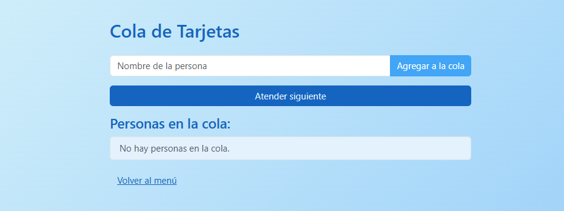
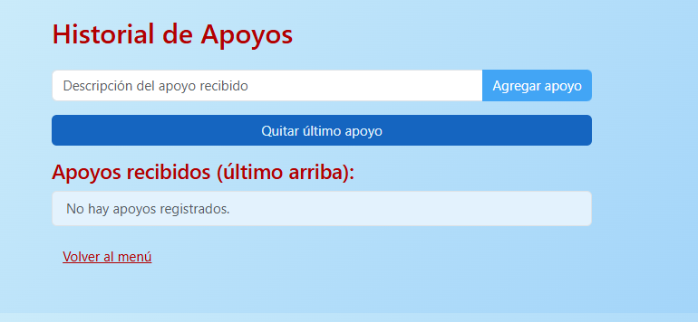

# *Sistema de Apoyos y Tarjetas* 

***Alumno:*** Erika Vianey Jimenez Pelayo

***Grupo y Materia:*** Estructura de Datos - A

***Maestro:*** Kevin David Molina Gomez


## <u>Descripción </u>
Esta aplicación web permite administrar de manera sencilla la entrega de tarjetas mediante una cola y llevar un registro de apoyos recibidos usando una pila. El sistema está pensado para simular procesos de atención y registro, facilitando la gestión y visualización de ambos flujos de datos.

## <u>Instrucciones rápidas</u>
1. Instala Flask:
    ```
    pip install flask
    ```
2. Ejecuta la app:
    ```
    python app.py
    ```
3. Abre en tu navegador: [http://127.0.0.1:5000/](http://127.0.0.1:5000/)

## <u>Ejemplo de uso </u>
- Para entregar tarjetas, accede a la sección "Entregar Tarjetas", agrega los nombres de las personas y atiéndelas en el orden en que llegaron.





- Para registrar apoyos, entra en "Historial de Apoyos", añade cada apoyo recibido y, si es necesario, elimina el último registrado.




- Se logra mostrar un facil seguimiento de cada uno de los espacios dados tanto de la entrega de tarjetas e historial de apoyos 